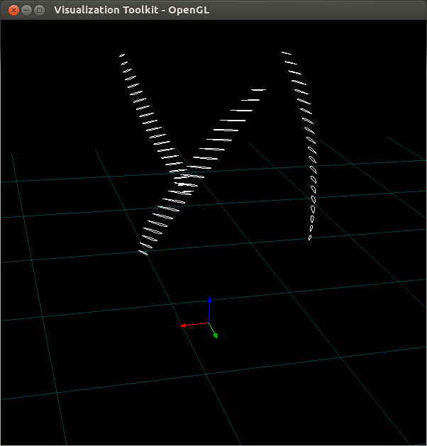
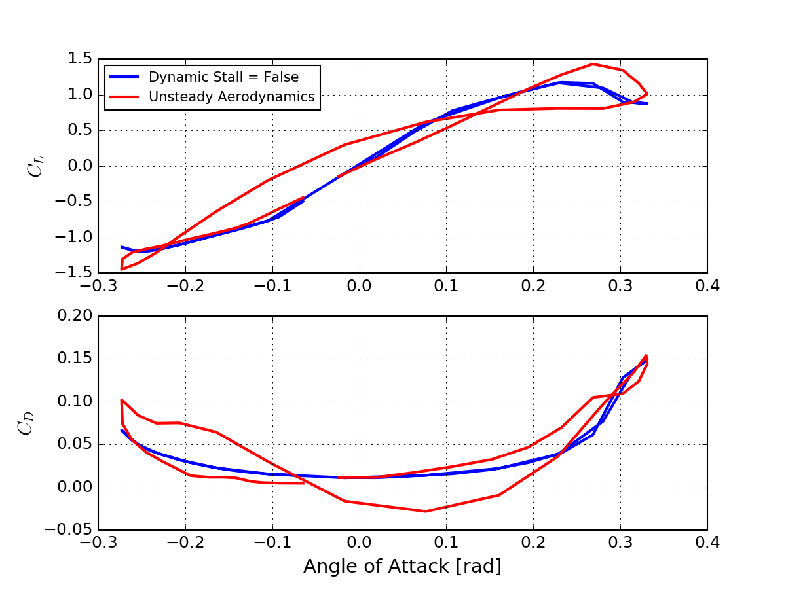
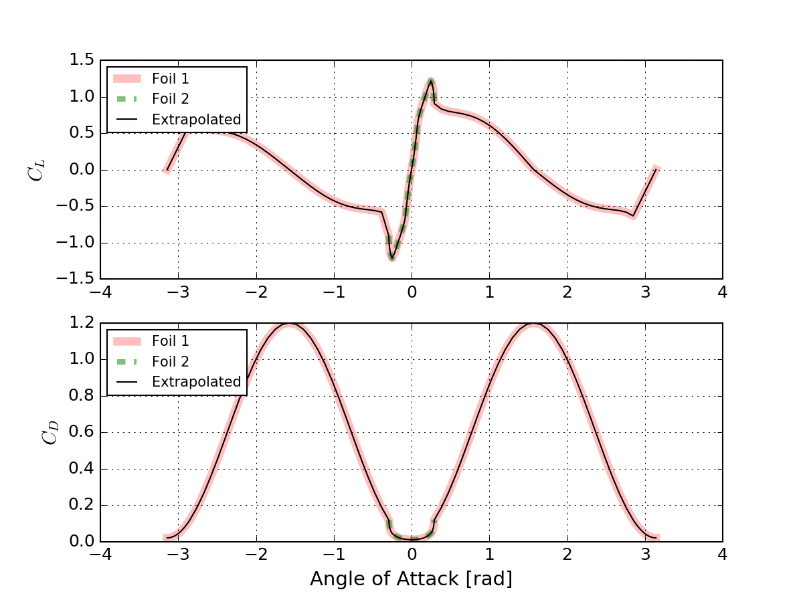
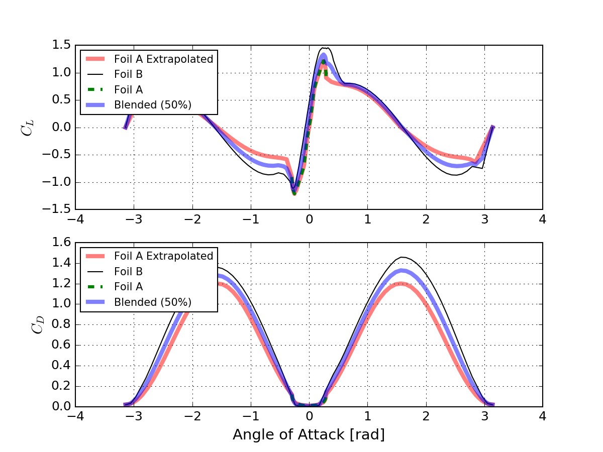
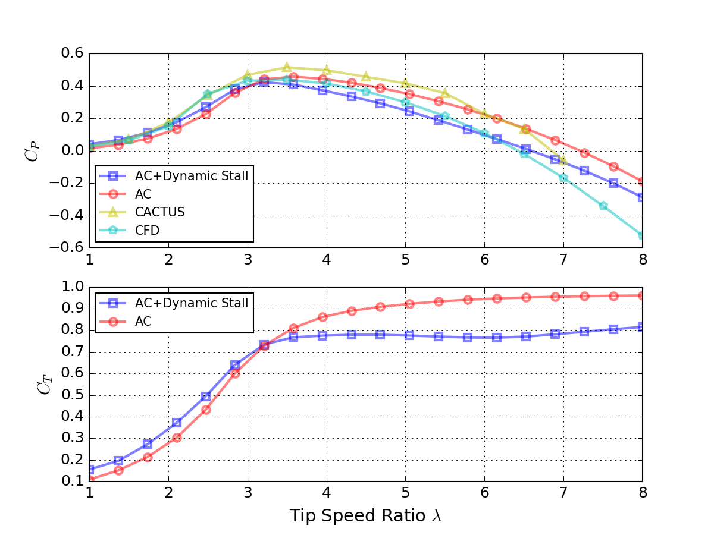
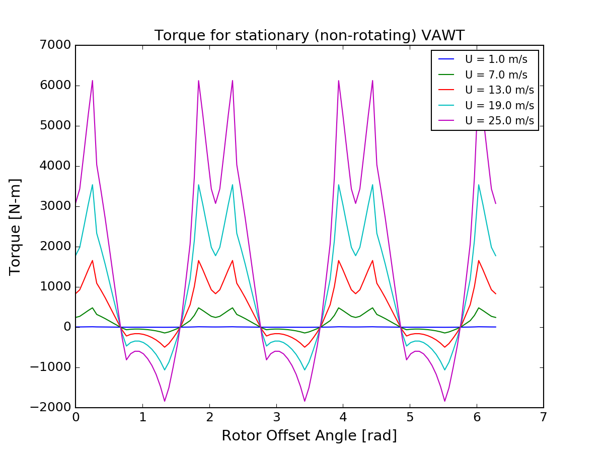

## LibV (or VAWT Library)

LibV is a modular program to model the aerodynamic performance of vertical axis wind turbine concepts. Since LibV is inherently a library, functions can be called in different sequences. This enables the flexibility to use LibV as a design optimization tool, apply it in time domain assessments, or in combination with other third-party packages,  

LibV's user interface is written in python, computational backend is defined in C, and the rendering engine in C++. Unit tests are supplied to demonstrate the program use in python.  

Details on the theory inside LibV is described [here](http://flowlab.groups.et.byu.net/publications/Ning2016-Actuator-Cylinder.pdf). LibV adopts source from A. Ning's AirfoilPrep.py ([here](http://wisdem.github.io/AirfoilPreppy/)) and VAWT-AC ([here](https://github.com/byuflowlab/vawt-ac)). 

LibV is licensed under Apache version 2.

**Unit Test 1**

Render the VAWT geometry [here](https://bitbucket.org/mmasciola/libv/src/c518f35ec771e198222528166c8c100f9d753137/python/test.py?at=master&fileviewer=file-view-default#test.py-18)

**Unit Test 2**

Demonstration of the dynamic stall features by comparing the steady and unsteady aerodynamic coefficients [here](https://bitbucket.org/mmasciola/libv/src/c518f35ec771e198222528166c8c100f9d753137/python/test.py?at=master&fileviewer=file-view-default#test.py-86).

**Unit Test 3**

Airfoil coefficients are often defined over a limited range. This test reveals how LibV can extrapolate lift and drag coefficients over the full 360 degree polar [here](https://bitbucket.org/mmasciola/libv/src/c518f35ec771e198222528166c8c100f9d753137/python/test.py?at=master&fileviewer=file-view-default#test.py-166).

**Unit Test 4**

Demonstration of the the blending between two airfoils to create one hybrid shape [here](https://bitbucket.org/mmasciola/libv/src/c518f35ec771e198222528166c8c100f9d753137/python/test.py?at=master&fileviewer=file-view-default#test.py-200).

**Unit Test 5**

Comparison of the power coefficient produce by LibV against other published data [here](https://bitbucket.org/mmasciola/libv/src/c518f35ec771e198222528166c8c100f9d753137/python/test.py?at=master&fileviewer=file-view-default#test.py-232).

**Unit Test 6**

Torque produces by a VAWT in an idling state [here](https://bitbucket.org/mmasciola/libv/src/c518f35ec771e198222528166c8c100f9d753137/python/test.py?at=master&fileviewer=file-view-default#test.py-339).

