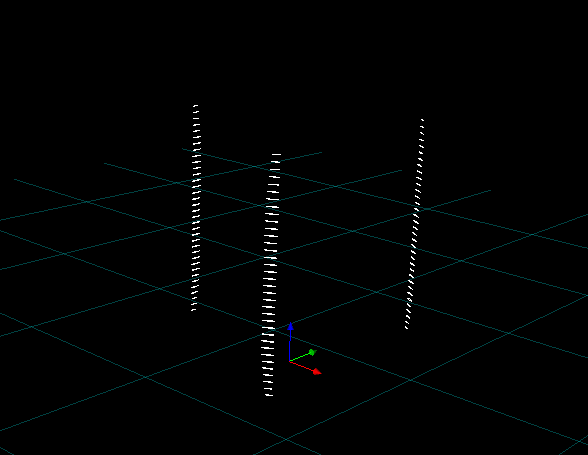
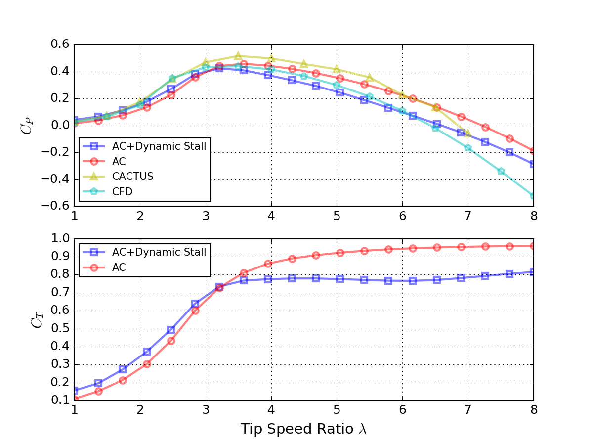
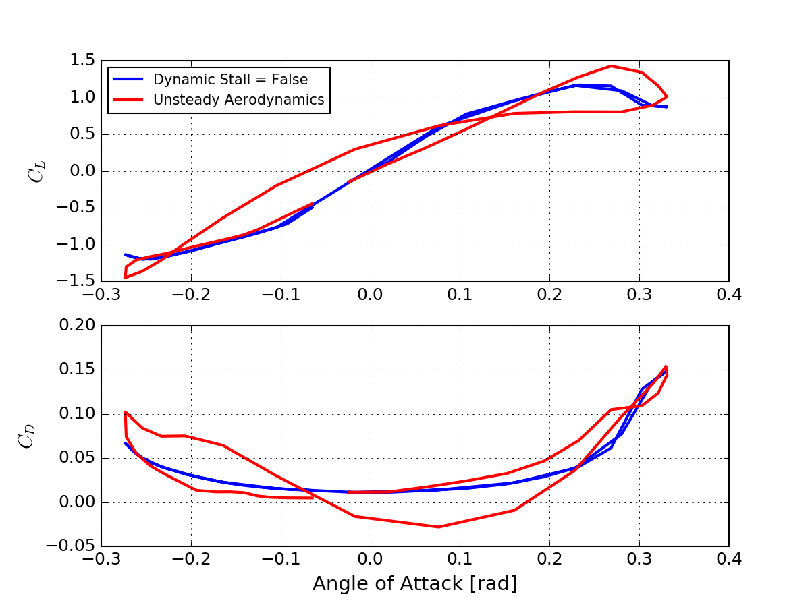
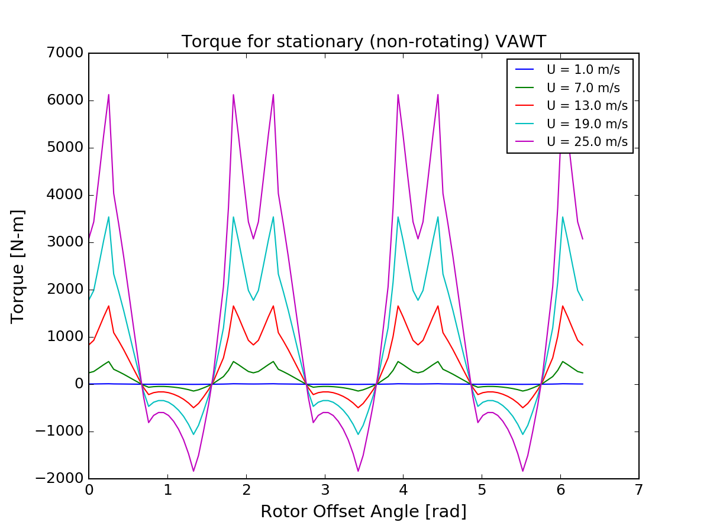

## LibV (or VAWT Library)

LibV is a modular program to analyze the aerodynamic performance of vertical axis wind turbines. The modular nature of the program allows for performance optimization. Unit tests are created in python to illustrate how the program functions. 

More information on the theory behind LibV is described [here](http://flowlab.groups.et.byu.net/publications/Ning2016-Actuator-Cylinder.pdf). LibV reuses codes from NREL FAST (the dynamic stall module) and A. Ning's AirfoilPrep.py and VAWT-AC. 

LibV is licensed under Apache version 2.

